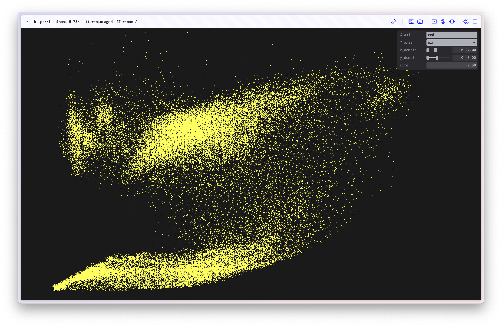

# 01 Scatter Plot

This PoC focuses on reading data from the Landsat image into a storage buffer. I've decided to use a single interleaved storage buffer as it seemed to naturally allow for switching between different bands by just switching the offset index.

## Results

