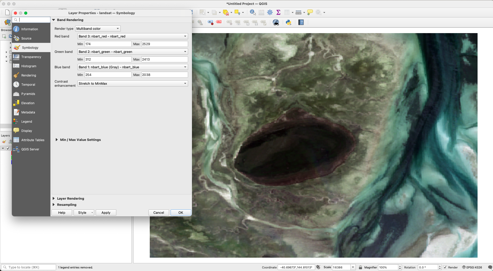

# 03 Landsat Image

This PoC will be the same as [the previous one](../02-generated-image) but we'll load a Landsat based [Digital Earth Australia (DEA) baseline surface reflectance data](https://www.ga.gov.au/scientific-topics/dea/dea-data-and-products/dea-surface-reflectance). This specific dataset was exported from the [DEA map](https://maps.dea.ga.gov.au/#share=s-02TACjEp7EBe0FBXTOYPXvGts7f).

## Results

Results look good. See a comparison to a QGIS rendering with the same settings below.

### What mine looks like

### What QGIS looks like

