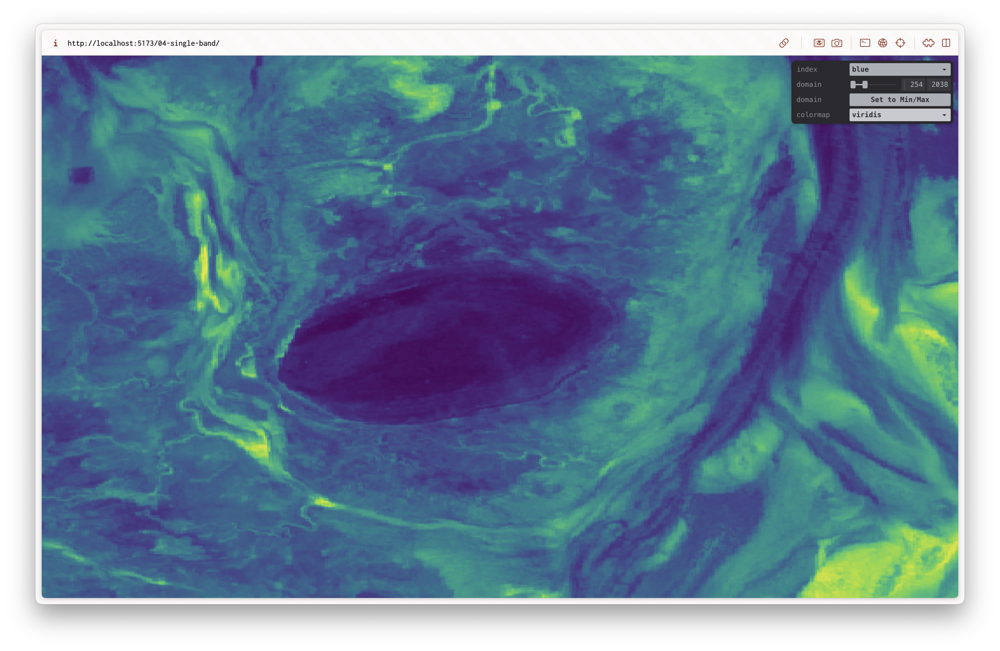
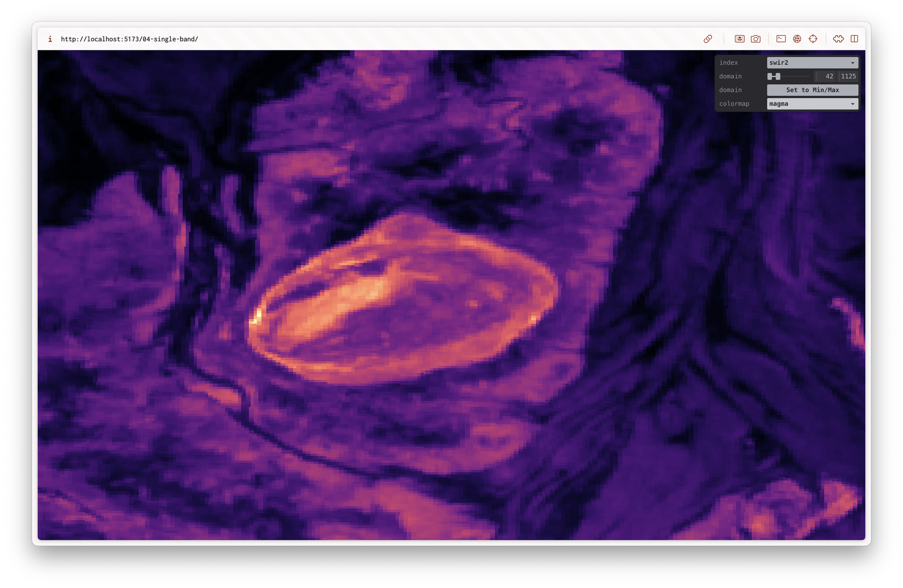

# 04 Single Band

This PoC continues on from [03-landsat-image](../03-landsat-image) and uses the same Landsat image. However it only renders a single band of the dataset. This version pre-processes the data to extract the minimum and maximum values for each band that are auto set when you switch a band. We also use an approximation of some of the matplotlib colourmaps taken from [Matt Zucker's Shadertoy](https://www.shadertoy.com/view/WlfXRN) example. In the future 1D texture LUDs could be used to provide a more accurate representation of the colourmaps.

## Results

