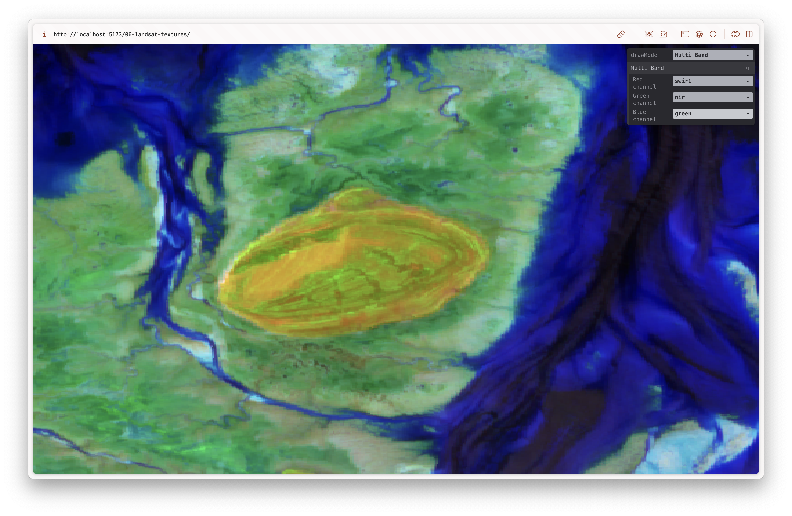
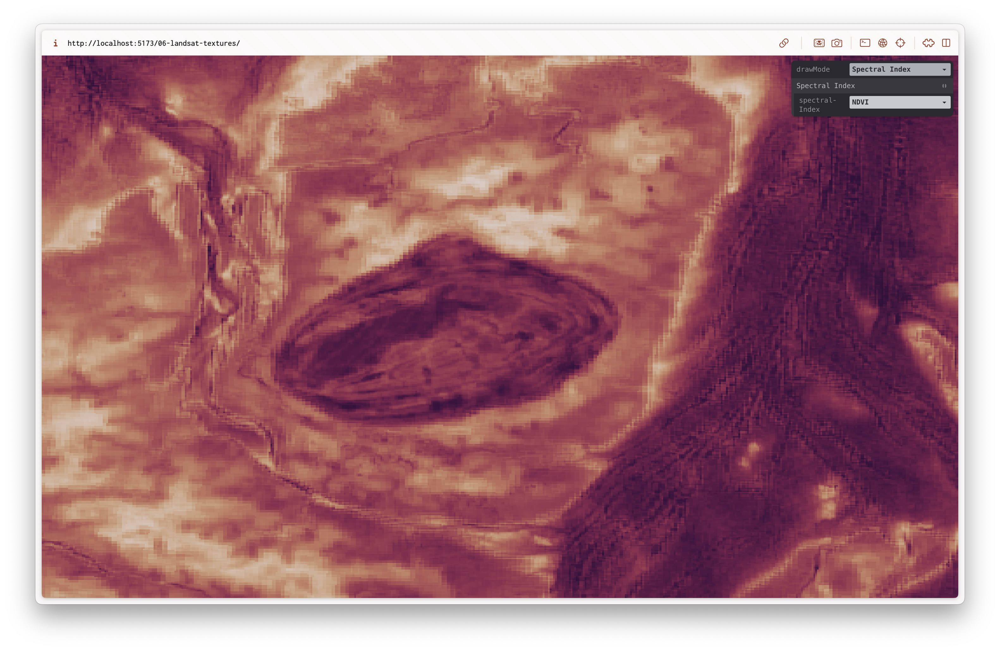

# Landsat Textures

This PoC is a culmination of the ones before. It uses a 2D texture array for storing our loaded data. It allows for visualising a single band using a color map, or any combination of the bands in the RGB channels. It also allows for calculating and visualising spectral indices.

## Results

### Single Band

### Multi Band

### Spectral Index

