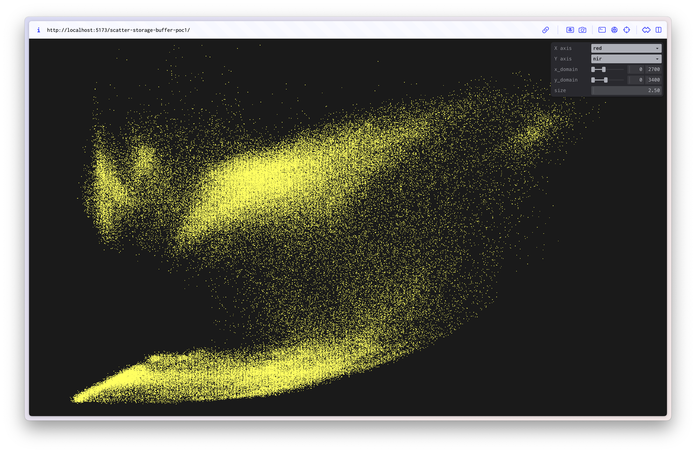
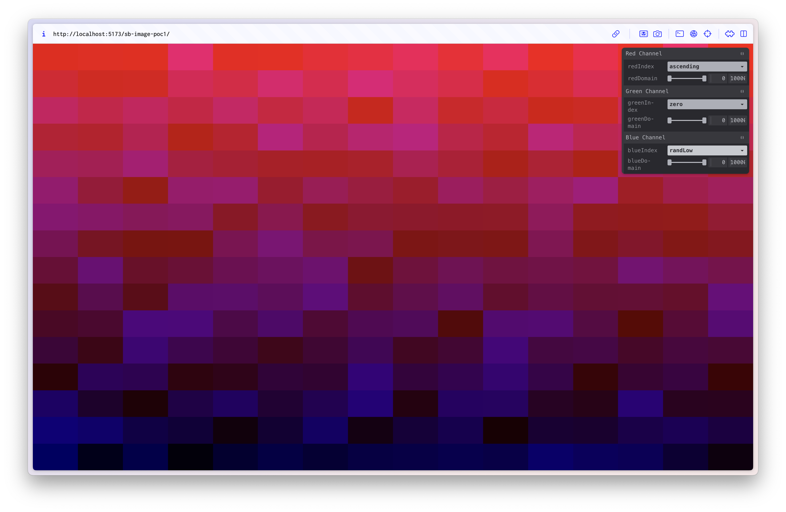
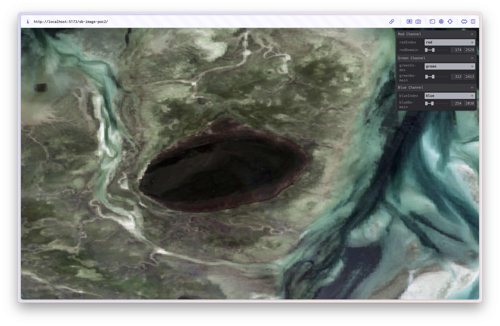
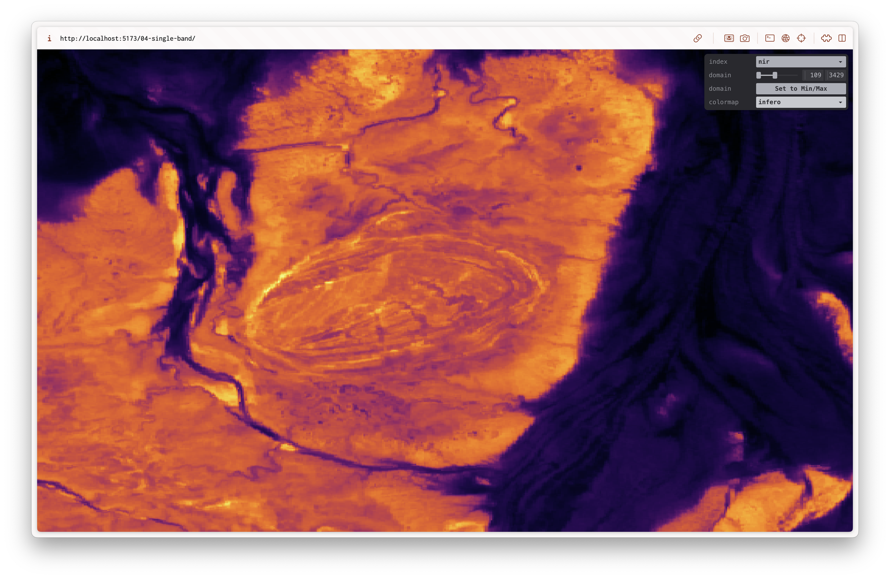
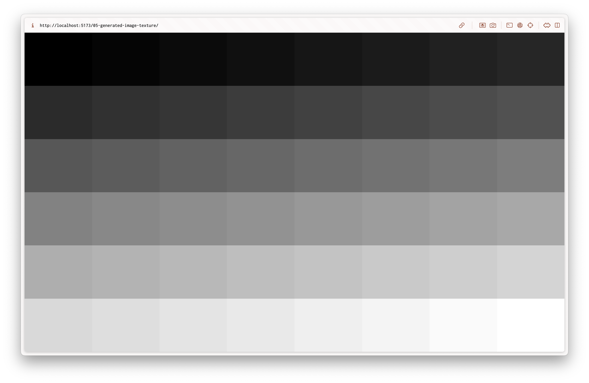
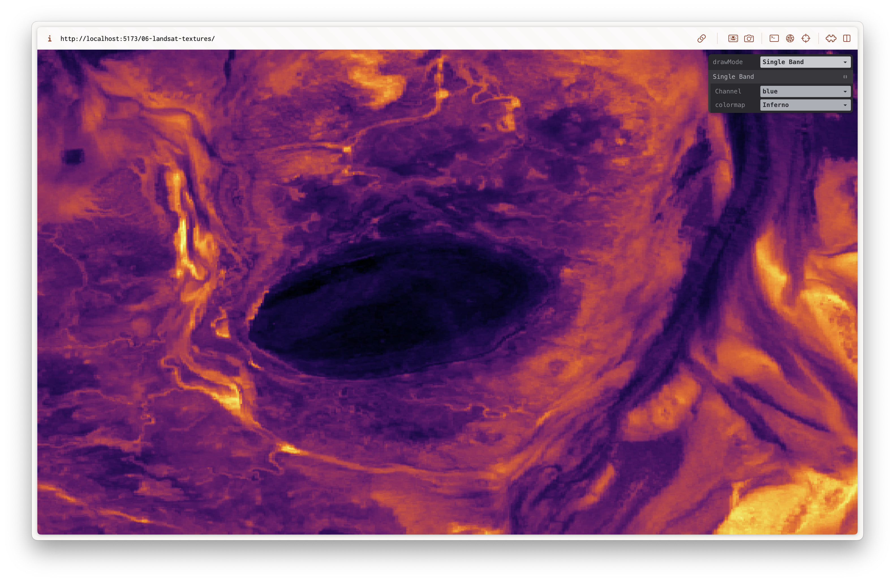
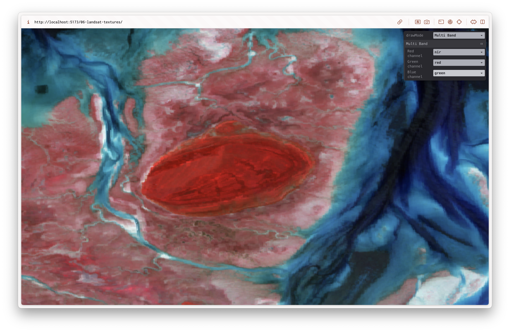
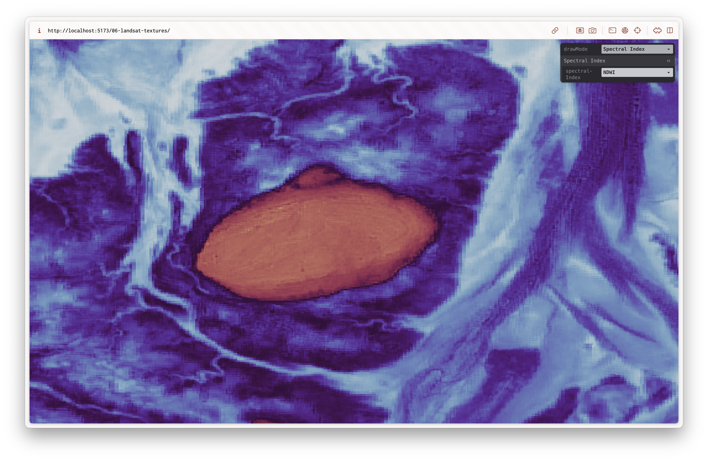

# Multi Spectral Sensor (MSS) WebGPU Viewer PoCs

This repo consists of multiple proof of concepts (PoC) for rendering multi spectral sensor (MSS) data in a web browser using WebGPU.
It is mostly a learning project for me to learn WebGPU, however, it is also driven by some real world motivations.

## Motivations

This year I took [Environmental Remote Sensing A](https://www.utas.edu.au/courses/cse/units/kgg542-environmental-remote-sensing-a) as part of my [Master of Environmental Geospatial Sciene](https://www.utas.edu.au/study/postgraduate/environmental-geospatial-sciences) at UTas. In this subject we used [ENVI](https://www.nv5geospatialsoftware.com/Products/ENVI) and a little bit of [QGIS](https://www.qgis.org/) for working with multi spectral sensor (MSS) and hyper spectral sensor (HSS) data. While the software obsviously has a lot of features the user experience for simply viewing and exploring the data is not great. Similarly, if accessing MSS or HSS data via a Jupyter notebook, the common visualisation approach is to use [matplotlib](https://matplotlib.org/). The result is often fairly small images in your notebook without any interactivity. In both of these tools, changing bands in a visualisation, or selecting a spectral index can take ~1s to update and render. I imagine this is because the data is being processed on the CPU. I wanted to try loading the raw band data onto the GPU and performing any calculations to render a particular band combo or spectral index on the GPU in realtime.

I've have also been wanting to learn WebGPU so I chose that as the graphics API. As this was a learning project I avoided most external libraries. As such the PoCs are pretty bare bones.

# Results

See the [final PoC](https://mss-webgpu-viewer-poc.vercel.app/09-multi-view/) for a visualisation of all possible band combinations for a Landsat image. The user can zoom and pan around the canvas. For the demo, I've used a sentinel image taken from the [DEA map](https://maps.dea.ga.gov.au/#share=s-02TACjEp7EBe0FBXTOYPXvGts7f). It has 13 bands, so there are `13 * 13 * 13 = 2197` possible band combinations. They are all rendered in realtime with no performance issues.


## Feasibility in a real application

If this was a native application, this type of rendering is very feasible. There's no need to have any delay or processing if one wanted to view a specific band combination or spectral index, it could all be done on the fly.

However, in a web application the amount of data would be a bottleneck, especially if creating a service for a large area (e.g. state, nation or pass of a satellite like with DEA). In these scenarios the data is split into tiles, usually 256x256. Pre computed the RGB(A) values can be stored as 1 byte each, so `256 * 256 * 4 = 262,144 bytes` per tile, or roughly `262KB`. Further, these are usually sent to the client as PNG and are may be around `150KB` compressed. To send all the raw band data we would need `2 bytes` per band pixel (as they are usually stored as an `Int16`). For our demo with 13 bands, each tile would require `256 * 256 * 2 * 13 = 1,703,936 bytes` or roughly `1.7 MB` or `1,700 KB`, an order of magnitude larger. This may be feasible in some environments but not for a public facing web application.

## Using WebGPU

Using the WebGPU API directly demystified a lot of the rendering process for me. This was a fairly basic use case so it wasn't too painful using the raw API.

There's a lot of low level decisions to be made when doing it yourself, and there's multiple ways to do similar things. For example I initially had data in storage buffers, then moved them to 2D texture arrays. While 2D texture arrays might be "more correct" it was still totally fine to do it in a storage buffer.

Memory management is a PITA however doing it yourself at least once really helped me understand what was going on.

One of my main takeaways is realising how useful libraries like Three.js are, but also how much extra stuff they have to bake in to make some rendering generic. I still am not really sure how to build a more generic renderer in something like WebGPU or if its really worth it.

Another similar takeaway is understanding how useful the three.js examples / plugins are. For example, something like Drei in the react-three-fiber ecosystem. They provide a lot of useful abstractions and components that would be a pain to write yourself.

One part of WebGPU I thought I might use was compute shaders. However, I didn't really require them for my use case, and even though I haven't dove into them too much, they seem quite complex to set up / reason about.

## Next Steps

I'm not sure I want to progress any further with this use case at the moment. To make something like this more useful is more a question of the UI / UX layer, and not so much on the rendering side. Additionally, as the data is the bottleneck, I'm not sure how useful something like this would be unless you turned it into a native application through something like Electron. I'm not super interested in that at the moment.


# Usage

```
npm install
npm run dev
```

# Proof of Concepts

## [01. Scatter plot](01-scatter-plot/)

Plotting the values of selected bands in a scatter plot. The data for the bands is loaded into the GPU in a single interleaved storage buffer. The scatter plot is drawn using instanced quads.



## [02. Generated image](02-generated-image/)

Rendering an image onto a quad from data in a single interleaved storage buffer. This is different to the standard way of using textures to render an image onto a surface. Data values are generated in specific patterns and range between 0 - 10,000. These values are normalised into colours on the fly by the fragment shader.




## [03. Landsat image](03-landsat-image/)

Using the same rendering technique as the previous PoC, this time we load a Landsat based [Digital Earth Australia (DEA) baseline surface reflectance data](https://www.ga.gov.au/scientific-topics/dea/dea-data-and-products/dea-surface-reflectance). This specific dataset was exported from the [DEA map](https://maps.dea.ga.gov.au/#share=s-02TACjEp7EBe0FBXTOYPXvGts7f).



## [04. Single band](04-single-band/)

This PoC continues on from [03-landsat-image](03-landsat-image) and uses the same Landsat image. However it only renders a single band of the dataset using an approximation for some matplotlib colourmaps.



## [05. Generated image texture](05-generated-image-texture/)

Using `texture_2d_array` instead of a single storage buffer.



## [06. Landsat textures](06-landsat-textures/)

A culmination of the PoCs so far. Allows for 3 drawing modes: Single band, multi band and spectral index.





## [07. Canvas](07-canvas/) & [08. Canvas 3D Ortho](08-canvas-3d-ortho/)

Not very interesting PoCs. Just creating a movable canvas so I can lay out multiple images. I'm using
[mjolnir.js](https://github.com/uber-web/mjolnir.js) to handle the user input. PoC07 used a 2D canvas
and used 3x3 matrices to handle the transformations. PoC08 used a 3D canvas and used more standard
view and projection 4x4 matrices.

## [09. Multi View](09-multi-view/)

Visualises all possible band combinations on an interactive canvas.


