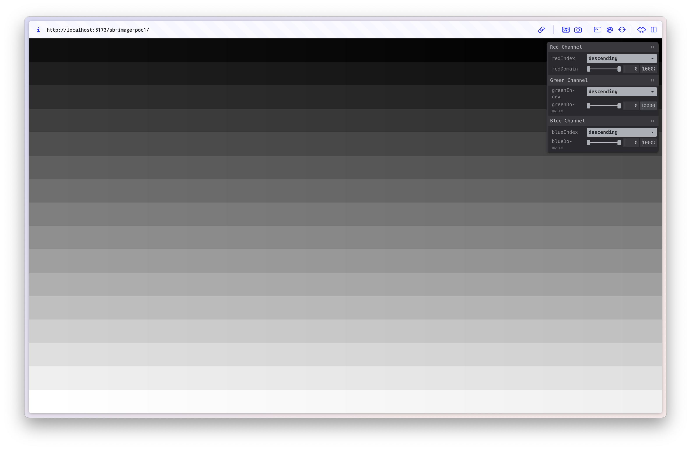

# Multi Spectral Sensor (MSS) WebGPU Viewer PoCs

This repo consists of multiple proof of concepts (PoC) for rendering multi spectral sensor (MSS) data in a web browser using WebGPU.
It is mostly a learning project for me to learn WebGPU, however, it is also driven by some real world motivations.

## Motivations

This year I took [Environmental Remote Sensing A](https://www.utas.edu.au/courses/cse/units/kgg542-environmental-remote-sensing-a) as part of my [Master of Environmental Geospatial Sciene](https://www.utas.edu.au/study/postgraduate/environmental-geospatial-sciences) at UTas. In this subject we used [ENVI](https://www.nv5geospatialsoftware.com/Products/ENVI) and a little bit of [QGIS](https://www.qgis.org/) for working with multi spectral sensor (MSS) and hyper spectral sensor (HSS) data. While the software obsviously has a lot of features the user experience for simply viewing and exploring the data is not great. Similarly, if accessing MSS or HSS data via a Jupyter notebook, the common visualisation approach is to use [matplotlib](https://matplotlib.org/). The result is often fairly small images in your notebook without any interactivity.

## Why WebGPU?

The primary reason is that I want to learn WebGPU. I have experience using WebGL through libraries like [three.js](https://threejs.org/) and [deck.gl](https://deck.gl/) but I've never fully grasped what's going on under the hood. To get a better feel for the underlying mechanics I'm avoiding external graphics libraries as much as possible.

# Usage

```
npm install
npm run dev
```

# Proof of Concepts

## [01. Scatter plot](01-scatter-plot/)

Plotting the values of selected bands in a scatter plot. The data for the bands is loaded into the GPU in a single interleaved storage buffer. The scatter plot is drawn using instanced quads.


## [02. Generated image](02-generated-image/)

Rendering an image onto a quad from data in a single interleaved storage buffer. This is different to the standard way of using textures to render an image onto a surface. Data values are generated in specific patterns and range between 0 - 10,000. These values are normalised into colours on the fly by the fragment shader.




## [03. Landsat image](03-landsat-image/)

Using the same rendering technique as the previous PoC, this time we load a Landsat based [Digital Earth Australia (DEA) baseline surface reflectance data](https://www.ga.gov.au/scientific-topics/dea/dea-data-and-products/dea-surface-reflectance). This specific dataset was exported from the [DEA map](https://maps.dea.ga.gov.au/#share=s-02TACjEp7EBe0FBXTOYPXvGts7f).


## [04. Single band](04-single-band/)

This PoC continues on from [03-landsat-image](03-landsat-image) and uses the same Landsat image. However it only renders a single band of the dataset using an approximation for some matplotlib colourmaps.


## [05. Generated image texture](05-generated-image-texture/)

Using `texture_2d_array` instead of a single storage buffer.


## [06. Landsat textures](06-landsat-textures/)

A culmination of the PoCs so far. Allows for 3 drawing modes: Single band, multi band and spectral index.


