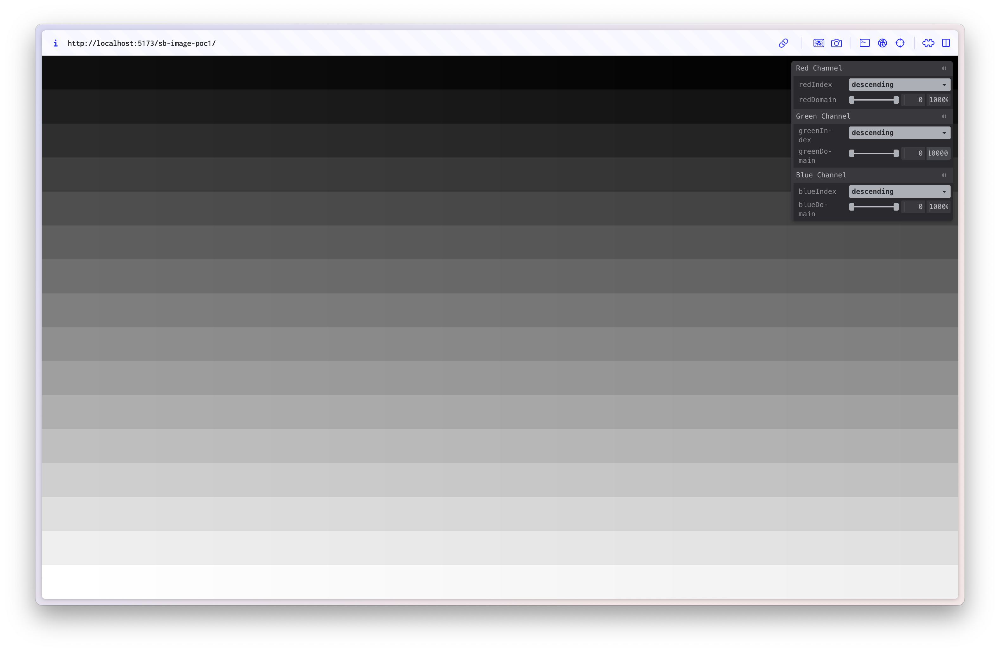
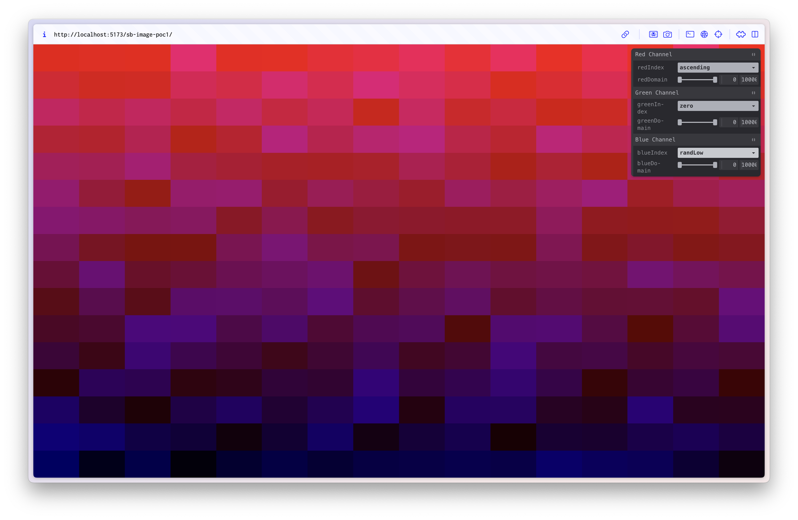
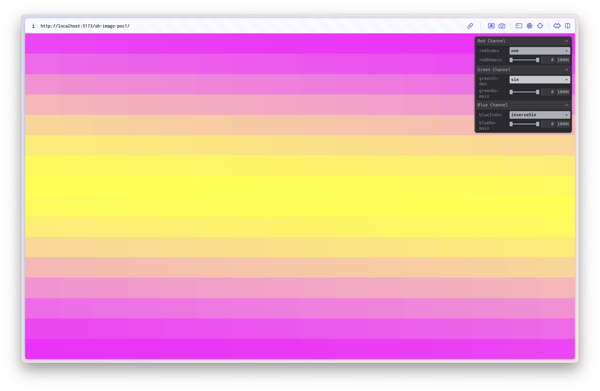
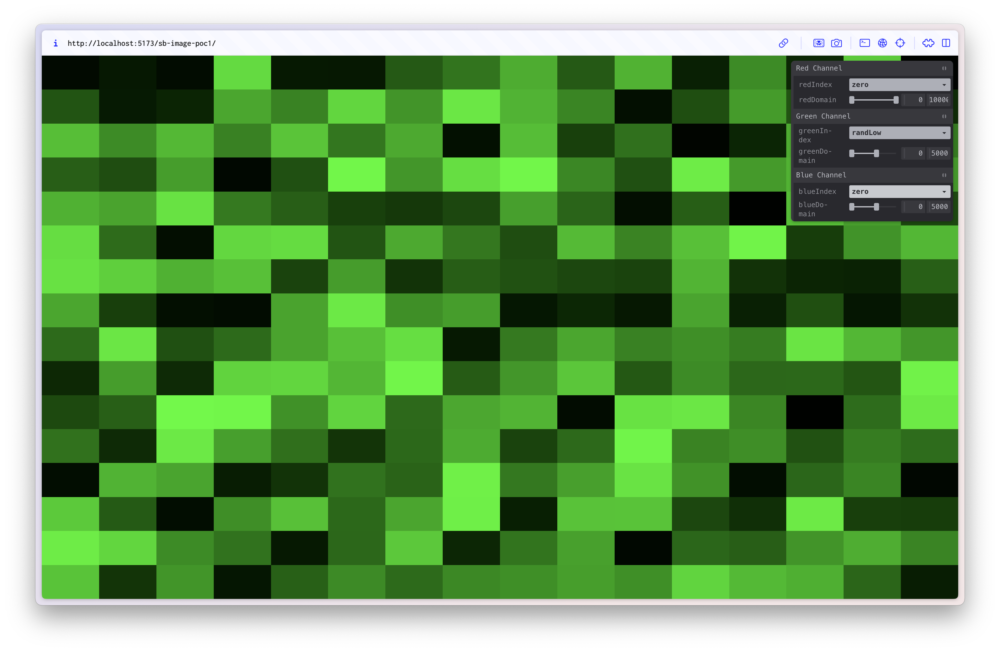

# Storage Buffer Image PoC

Normally when rendering an image to a quad, you would use a texture. The texture data often comes
from an image thats already in something like 8-bit RGB format. However, I already have all the MSS data
in one large storage buffer. So i want to use this as the source of the data and manually "sample" it as if it was a texture.

For this fist PoC I'll just use generated data into the storage buffer. I will essentially just be doing nearest sampling.
I've generated data in different patters as a way to visually validate the rendering is correct.

## Results

