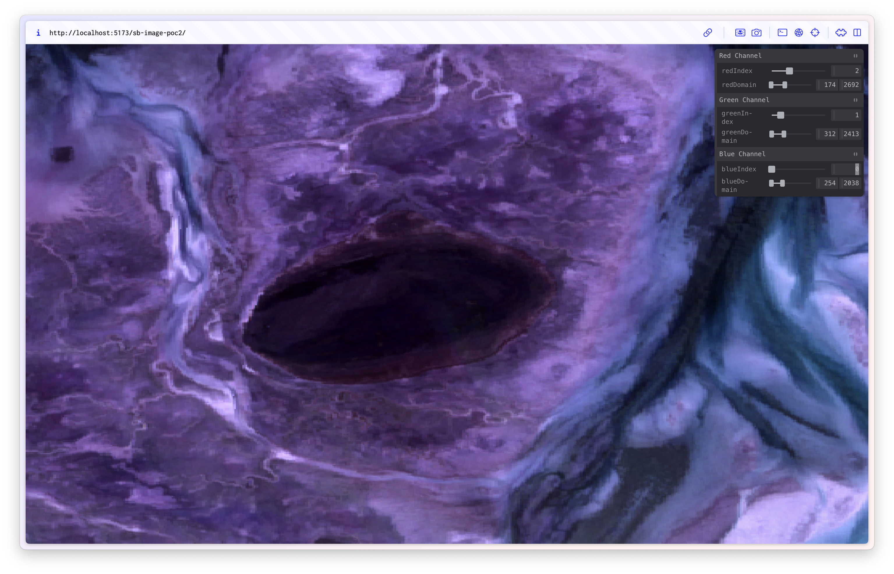
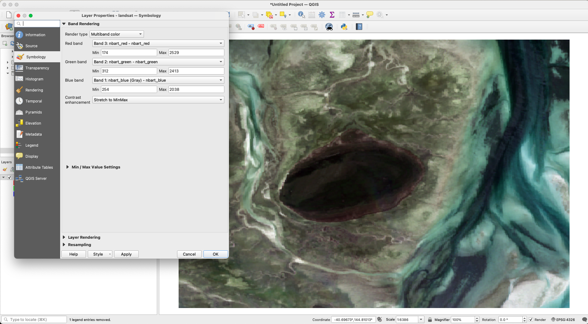

# Storage Buffer Image PoC 2

PoC2 will be the same as 1 but we'll load our geotiff image.

## Results

Obviously I'm doing something wrong as the colours do not look correct.
The features in the image are the right shape so we are at least loading the correct pixels.

### What it looks like

### What it should look like

What's weird is when I deliberately created specific patterns in the data in poc1
(e.g. gradients) using values from 0 to 10,000, those colours looked correct.

So either something is going wrong when loading the data, I am making some other kind of mistake somewhere,
or I don't properly understand how contrast stretching works.
